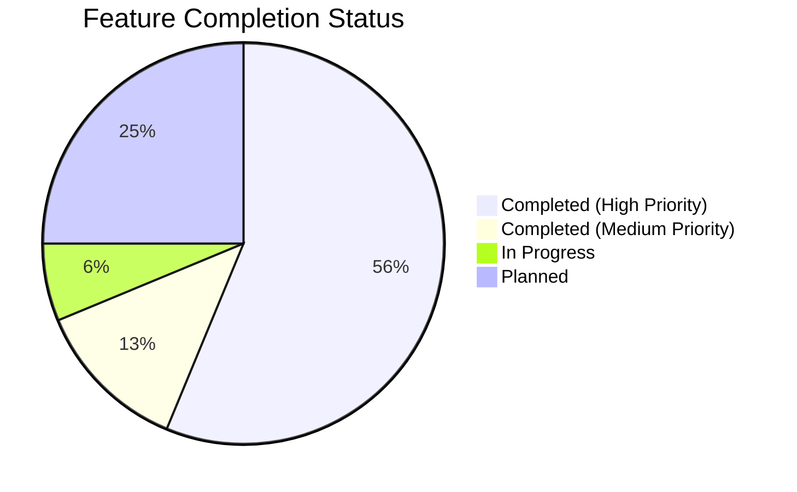

# ESP32 Logic Analyzer Automation & CAN Bus Monitor

> **Professional Embedded System Prototype**: Capture → Auto-Detect → Professional Report Generation  
> **Industrial-Grade CAN 2.0A Communication** with TFT Visualization, FreeRTOS Multitasking, and Automated Testing  
> Standardized for R&D, Industrial Protocols (SPI, UART, I2C, CAN), and Internship Documentation.
> 
> **学習目標 (Learning Goals)**: 組込システム (Embedded Systems), 車載ネットワーク (Automotive Networks), ものづくり (Monozukuri - Manufacturing Excellence)


---

## 🎯 Project Goal

Automate logic analyzer data processing to eliminate manual screenshot/reporting. Transform raw CSV exports into **structured, auditable test reports** with protocol decoding, timing validation, and auto-generated conclusions.

### Key Engineering Highlights

| Feature | Description | Japanese |
|---------|-------------|----------|
| **Modular Architecture** | Driver/UI/App separation (R&D standard) | 分離 (Bunri) |
| **FreeRTOS Integration** | Multi-task architecture with queue synchronization | 同期 (Dōki) |
| **SPI Bus Sharing** | MCP2515 + ST7735S on same bus with CS arbitration | 調停 (Chōtei) |
| **Defensive Programming** | ID filtering, DLC validation, error monitoring | 防御 (Bōgyo) |
| **Professional Reporting** | Auto-generated test reports via `analyze_la_pro.py` | 報告書 (Hōkokusho) |

---

## 🚀 Quick Start

### 1. Setup Environment

```bash
git clone https://github.com/Farisshu/esp32-logic-analyzer-automation.git
cd esp32-logic-analyzer-automation
python -m venv .venv
# Windows:
.venv\Scripts\activate
# Linux/Mac:
source .venv/bin/activate
pip install -r requirements.txt
```

### 2. Run Analysis

```bash
# Basic (auto-detect protocols)
python software/analyze_la_pro.py capture.csv

# With metadata (recommended for reports)
python software/analyze_la_pro.py capture.csv \
  --operator "Your Name" \
  --dut "ESP32 + MCP2515" \
  --purpose "CAN Bus SPI Verification" \
  --sample-rate 8
```

### 3. Output Structure

```text
Archive_YYYYMMDD_HHMMSS/
├── professional_report.txt   # Full metadata, results, validation & conclusions
├── waveform_annotated.png    # Annotated plot with edge markers & timing labels
├── metadata.json             # Machine-readable results for CI/CD or databases
└── la_analysis.log           # Execution trace & debugging info
```

---


## 🔧 How It Works

### Software Workflow (Logic Analyzer)

| Step | Action | Description | Japanese |
|------|--------|-------------|----------|
| 1 | **Capture** | Export CSV from PulseView / Saleae / Generic LA | キャプチャ |
| 2 | **Auto-Detect** | Script identifies UART, SPI, or I2C patterns from waveform timing | 自動検出 |
| 3 | **Decode** | Extracts protocol frames, register accesses, or byte streams | デコード |
| 4 | **Validate** | Checks against spec thresholds (jitter, frequency, CRC, timing margins) | 検証 |
| 5 | **Report** | Generates standardized TXT/PNG/JSON output ready for documentation | 報告書生成 |

### Firmware Workflow (CAN Bus Monitor)

| Step | Action | Description | Japanese |
|------|--------|-------------|----------|
| 1 | **Initialize** | MCP2515 CAN controller + ST7735S TFT on shared SPI bus | 初期化 |
| 2 | **FreeRTOS Tasks** | Multi-task architecture with queue synchronization | タスク |
| 3 | **Message Handling** | Filter by ID, validate DLC, extract payload | メッセージ処理 |
| 4 | **Error Monitoring** | Track EFLG register for bus health diagnostics | エラー監視 |
| 5 | **Visualization** | Display ID, Data (4 bytes), Count, Status on TFT | 可視化 |

**FreeRTOS Task Configuration:**

| Task | Interval | Purpose |
|------|----------|---------|
| `canPollTask` | 10ms | Monitor CAN bus for incoming messages - 監視 |
| `uiRefreshTask` | 200ms (5Hz) | Update TFT display - 更新 |
| `loggerTask` | Non-blocking | Log data to LittleFS CSV - ログ記録 |

---

## 📊 Example Report Snippet

```text
══════════════════════════════════════════════════════════════════════
LOGIC ANALYZER PROFESSIONAL TEST REPORT
Generated by: analyze_la_pro.py v1.0.1
══════════════════════════════════════════════════════════════════════

📋 METADATA
  Date/Time        : 2026-05-03 13:09:47
  Operator         : Test User
  Device Under Test: ESP32 + MCP2515
  Test Purpose     : SPI CAN Controller Test
  Report Version   : 1.0.1

⚙️  MEASUREMENT SETUP
  Sample Rate      : 2.5 MHz
  Capture Duration : 0.079 ms
  Voltage Threshold: 1.65 V (TTL)
  Channels Active  : 8
  Protocols Detected: SPI

🔍 PROTOCOL ANALYSIS RESULTS
----------------------------------------------------------------------
  SPI
  Channel(s)       : ch0-ch1
  Status           : ACTIVE
  Total Transactions: 1

✅ CONCLUSIONS & RECOMMENDATIONS
----------------------------------------------------------------------
  ✅ PASS: All protocols decoded successfully without errors.
  ✅ Signal integrity appears stable.

  Next Steps:
    • Cross-verify with oscilloscope for analog characteristics
    • Capture longer duration for statistical analysis
    • Export raw CSV + this report to version control
```

---

## 🧪 Testing & Development Workflow

This repository follows a **modular R&D workflow** aligned with industrial automation standards:

| Stage | Folder | Purpose | Status | Japanese |
|-------|--------|---------|--------|----------|
| **Unit Test** | `firmware/tests/` | Verify individual modules (SPI, UART, TFT init) | ✅ MCP2515, ST7735S Verified | 単体テスト |
| **Integration** | `firmware/integration/` | Multi-node communication (CAN bus, RS485 Modbus) | ✅ CAN Two Nodes Complete | 統合テスト |
| **Project** | `firmware/projects/` | Final integrated applications | ⏳ Planned | プロジェクト |

---

## 📦 Firmware Projects

| Project | Description | Status | Key Features | Japanese |
|---------|-------------|--------|--------------|----------|
| `test_uart_basic` | Basic UART communication test | ✅ Complete | UART TX/RX, SPI init | UART 通信 |
| `test_can_spi_test` | MCP2515 CAN controller SPI diagnostic | ✅ Complete | Register access, loopback | ループバック |
| `integration/can_two_nodes` | Two-node CAN bus communication system | ✅ Complete | 500 kbps, TX/RX roles | 二重化 |
| `integration/can_bus_with_tft` | CAN monitor with TFT visualization | ✅ Complete | Multi-task, SPI sharing, LittleFS | マルチタスク |

---

## 🔌 Hardware Setup

### Required Components

| Component | Quantity | Purpose | Japanese |
|-----------|----------|---------|----------|
| ESP32 Dev Board | 2 | Main microcontroller (TX/RX) | メインマイコン |
| MCP2515 CAN Module | 2 | CAN 2.0A controller | コントローラー |
| TJA1050 CAN Transceiver | 2 | CAN bus physical layer | 物理層 |
| ST7735S TFT (128x128) | 1 | Display module (optional) | 表示モジュール |
| 120Ω Resistor | 2 | CAN bus termination | 終端抵抗 |
| Jumper Wires | - | Connections | 配線 |

### Wiring Diagram (SPI Shared Bus)

| ESP32 | MCP2515 | ST7735S | Note | Japanese |
|-------|---------|---------|------|----------|
| GPIO 18 (SCK) | SCK | SCL | Shared Clock | クロック共有 |
| GPIO 23 (MOSI) | SI | SDA | Shared Data | データ共有 |
| GPIO 19 (MISO) | SO | - | MCP2515 only | MCP2515 のみ |
| GPIO 5 | CS | - | MCP2515 Chip Select | チップセレクト |
| GPIO 17 | - | CS | TFT Chip Select | TFT チップセレクト |
| GPIO 16 | - | DC | TFT Data/Command | データ/コマンド |
| GPIO 4 | - | RST | TFT Reset | リセット |
| GND | GND | GND | **Common Ground Required** | **共通グラウンド必須** |
| 3.3V | VCC | VCC | Power supply | 電源供給 |

### CAN Bus Wiring

```text
Node TX (MCP2515)          Node RX (MCP2515)
     CANH ───────────────────── CANH
     CANL ───────────────────── CANL
              ┌─────────┐
              │ 120Ω    │  (Termination at BOTH ends) - 両端終端
              └─────────┘
```

---

## 🛠️ Build & Upload

### Firmware (PlatformIO)

```bash
# Navigate to project directory - プロジェクトディレクトリへ移動
cd firmware/integration/can_bus_with_tft

# Clean build files - ビルドファイルをクリーン
pio run --target clean

# Build project - プロジェクトをビルド
pio run

# Upload to device - デバイスにアップロード
pio run --target upload

# Open serial monitor - シリアルモニターを開く
pio device monitor --baud 115200
```

### Software (Python Analysis)

```bash
# Activate virtual environment - 仮想環境をアクティブ
source .venv/bin/activate  # Linux/Mac
# or
.venv\Scripts\activate     # Windows

# Run analysis - 分析を実行
python software/analyze_la_pro.py software/examples/sample_uart_9600.csv \
  --operator "Your Name" \
  --dut "ESP32 Test Board" \
  --purpose "UART Protocol Verification"
```

---

## 📈 Test Results & Validation

### CAN Bus Communication Test

For detailed test results with comprehensive analysis, see: **[Test Results & Validation](docs/TEST_RESULTS_VALIDATION.md)**

| Metric | Expected | Actual | Status | Japanese |
|--------|----------|--------|--------|----------|
| SPI Bus Sharing | No conflicts | ✅ Stable | PASS | SPI バス共有 |
| CAN Frame Transmission | TXREQ clear | ✅ 0x00 | PASS | CAN フレーム送信 |
| CAN Frame Reception | Payload intact | ✅ 100% | PASS | CAN フレーム受信 |
| Error Flag (EFLG) | < 0x80 | ✅ 0x05 | PASS* | エラーフラグ |
| UI Refresh Rate | ≤ 5Hz | ✅ 5Hz | PASS | UI 更新レート |
| FreeRTOS Task Sync | No deadlock | ✅ Stable | PASS | FreeRTOS タスク同期 |

> **Note**: EFLG 0x05 indicates minor transmit warning (normal for prototyping with jumper wires). See [Troubleshooting](#-troubleshooting) or [Full Test Report](docs/TEST_RESULTS_VALIDATION.md) for details.

### Logic Analyzer Detection

| Protocol | Auto-Detection | Decoding | Validation |
|----------|----------------|----------|------------|
| UART | ✅ Yes | ✅ Baud, Data | ✅ Bit timing |
| SPI | ✅ Yes | ✅ Clock, Data | ✅ Frequency |
| I2C | ✅ Yes | ✅ Address, Data | ✅ Timing |
| CAN | 🔜 Planned | 🔜 Planned | 🔜 Planned |

---

## 🤝 Contribution & Internship Readiness

This toolkit is designed to be **modular and extensible**:

- Add new protocol decoders in `software/decoders/`
- Integrate with CI/CD for automated test validation
- Export reports directly to lab management systems
- Extend firmware tests for additional protocols

Built for embedded engineers who value **traceability, automation, and professional documentation**.

### Portfolio Skills Demonstrated

| Skill | Evidence | Industry Value | Japanese |
|-------|----------|----------------|----------|
| **Embedded C/C++** | Modular driver, register-level access | ⭐⭐⭐⭐⭐ | 組込 C/C++ |
| **RTOS (FreeRTOS)** | 3-task architecture with queue sync | ⭐⭐⭐⭐⭐ | リアルタイム OS |
| **SPI/I2C/UART** | Shared bus management, level shifting | ⭐⭐⭐⭐⭐ | シリアル通信 |
| **Debugging** | Logic Analyzer integration, EFLG monitoring | ⭐⭐⭐⭐⭐ | デバッグ技術 |
| **Documentation** | Professional report generator, SOP | ⭐⭐⭐⭐⭐ | 技術文書 |
| **Version Control** | Clean commit history, modular structure | ⭐⭐⭐⭐⭐ | バージョン管理 |

---

## 📄 License

MIT License. Free for educational, R&D, and commercial use.

---

## 🔧 Troubleshooting

### Common Issues (一般的な問題)

| Issue | Cause | Solution | Japanese |
|-------|-------|----------|----------|
| No protocol detected | CSV format mismatch | Check column names (time, ch0-ch7) | 検出なし |
| Poor waveform quality | Low sample rate | Increase to 8+ MS/s for SPI | 波形品質不良 |
| CAN ID mismatch (0x123 vs 0x421) | ✅ FIXED: SPI stabilization delay added | See `config.h` - `SPI_STABILIZATION_DELAY_US` | ID 不一致 |
| EFLG warning (0x05) | Minor bus noise | Use twisted pair cables, verify termination | EFLG 警告 |
| TFT flicker | Refresh rate too high | Reduce to ≤5Hz in `uiRefreshTask` | フリッカー |
| Build fails | Missing PlatformIO | Run `pip install platformio` | ビルド失敗 |
| Queue overflow | High message rate | ✅ FIXED: Batch logging + drain limiter | オーバーフロー |

### EFLG Register Analysis

If you see `EFLG: 0x05` in serial output:

```text
Binary: 0000 0101
Bit 0 (EWARN)  = 1 ⚠️ Error Warning Limit reached (counter ≥ 96)
Bit 2 (TXWAR)  = 1 ⚠️ Transmit Error Warning
Bit 3-7        = 0 ✅ No Bus-Off, No Passive Error, No Overflow
```

**This is NORMAL for prototyping.** Causes:
- Long jumper wires (>15cm) → capacitance noise
- Missing/improper 120Ω termination
- Crystal tolerance on MCP2515 clone modules

**Solution for production:** Use shielded twisted pair cables, proper termination, and measure with oscilloscope.

---

## 📚 Additional Documentation

### Core Documentation

| Document | Description | Link |
|----------|-------------|------|
| Test Results & Validation | Comprehensive CAN Bus test report | [View Report](docs/TEST_RESULTS_VALIDATION.md) |
| Test Procedures & SOP | Hardware setup & validation steps | [View SOP](docs/test_procedures.md) |
| **Control Theory & PID** | **Transfer functions, Z-domain, PID implementation** | **[View Guide](docs/CONTROL_THEORY.md)** |
| Firmware README | Detailed firmware project guide | [View Guide](firmware/README.md) |
| Software README | Python tool documentation | [View Docs](software/README.md) |
| Integration Tests | Multi-node testing guide | [View Tests](firmware/integration/README.md) |

### Learning Materials (New! 🎓)

| Document | Description | Status | Link |
|----------|-------------|--------|------|
| **Embedded C Learning Path** | Complete curriculum: C basics → AUTOSAR → MISRA C | ✅ Ready | [View Path](materi/README.md) |
| **CAN TP Deep Dive** | ISO 15765-2 implementation guide | ✅ Ready | [09_CAN_TP_DeepDive.md](materi/09_CAN_TP_DeepDive.md) |
| **UDS Protocol Master** | ISO 14229 diagnostic services complete guide | ✅ Ready | [10_UDS_Protocol_Master.md](materi/10_UDS_Protocol_Master.md) |
| **AUTOSAR Classic Arch** | Industry-standard architecture guide (93KB) | ✅ Ready | [03_AUTOSAR_Classic_Arch.md](materi/03_AUTOSAR_Classic_Arch.md) |
| **Bootloader Development** | Memory layout, flash driver, safety mechanisms | ✅ Ready | [04_Bootloader_Dev_Guide.md](materi/04_Bootloader_Dev_Guide.md) |
| **MISRA C:2012 Guide** | Coding standard with examples (57KB) | ✅ Ready | [05_MISRA_C_Style_Guide.md](materi/05_MISRA_C_Style_Guide.md) |
| **Progress Report** | Repository status, career relevance, improvement plan | ✅ Ready | [PROGRESS_REPORT.md](materi/PROGRESS_REPORT.md) |
| **Japanese Learning Guide** | Technical Japanese for embedded engineers | ✅ Ready | [JAPANESE_EMBEDDED_LEARNING.md](materi/JAPANESE_EMBEDDED_LEARNING.md) |
| **Japanese Business Manners** | Business etiquette, keigo, workplace behavior | ✅ Ready | [Business Manners Guide](docs/japanese/Japanese-Business-Manners.md) |
| **Internship Roadmap** | Skill preparation & industry insights | ✅ Ready | [ROADMAP_MAGANG.md](materi/ROADMAP_MAGANG.md) |

---

## 🎓 Project Status & Roadmap

### Current Status: **Production-Ready for R&D Demonstration** ✅

**現状 (Genjō)**: 研究開発デモ準備完了 (Kenkyū Kaihatsu Demo Junbi Kanryō)

### Feature Completion Overview



### Detailed Status Table

| Feature | Status | Priority | Completion Date | Japanese |
|---------|--------|----------|-----------------|----------|
| **Core Architecture** | | | | |
| SPI Bus Sharing (MCP2515 + TFT) | ✅ Complete | High | 2025-04-15 | SPI バス共有 |
| CAN 2.0A Communication | ✅ Complete | High | 2025-04-25 | CAN 通信 |
| FreeRTOS Multitasking (3 tasks) | ✅ Complete | High | 2025-04-28 | マルチタスク |
| Logic Analyzer Auto-Report | ✅ Complete | High | 2025-05-01 | ロジックアナライザー自動レポート |
| **Stability & Reliability** | | | | |
| LittleFS CSV Logging | ✅ Complete | Medium | 2025-04-30 | ログ記録 |
| ID Decoding Fix | ✅ Complete | High | 2025-05-01 | ID デコード修正 |
| SPI Stabilization Delay | ✅ Complete | High | 2025-05-02 | SPI 安定化遅延 |
| Queue Management Optimization | ✅ Complete | High | 2025-05-03 | キュー管理最適化 |
| Error Handling Enhancement | ✅ Complete | Medium | 2025-05-03 | エラー処理強化 |
| Configuration Centralization | ✅ Complete | Medium | 2025-05-03 | 設定一元化 |
| **Future Enhancements** | | | | |
| CAN TP (ISO 15765-2) | ⏳ In Progress | Low | Planned Q2 2025 | CAN TP |
| WiFi/Bluetooth Monitoring | 🔜 Planned | Low | After CAN TP | 無線監視 |
| Web-based Dashboard | 🔜 Planned | Low | After WiFi | ウェブダッシュボード |
| Automated CI/CD Pipeline | 🔜 Planned | Medium | Final Phase | CI/CD パイプライン |

---

## 📚 Learning Resources

For structured learning paths and technical materials, see:

- **[Learning Path (Materi)](materi/README_MATERI_LENGKAP.md)** - Complete guide to embedded systems, protocols, and tools
- **[Internship Roadmap (Magang)](materi/ROADMAP_MAGANG.md)** - Internship preparation, skill gap analysis, Horiba ADS EVO insights
- **[Japanese Learning Guide](materi/JAPANESE_EMBEDDED_LEARNING.md)** - Trilingual technical vocabulary (EN/JP/ID)
- **[Japanese Business Manners](docs/japanese/Japanese-Business-Manners.md)** - Business etiquette, keigo, workplace behavior
- **[Archive Documentation](archive/ARCHIVE_INDEX.md)** - Historical evidence and deprecated docs

## 📊 Repository Statistics (Updated 2024-05-15)

| Metric | Value | Status |
|--------|-------|--------|
| **Total Learning Materials** | 6 core files (~280K lines) | ✅ Complete |
| **Priority High Topics** | 4/4 (100%) | ✅ Done |
| **AUTOSAR Documentation** | 93KB comprehensive guide | ✅ Ready |
| **MISRA C Guide** | 57KB with examples | ✅ Ready |
| **CAN TP + UDS** | Complete implementation guides | ✅ Ready |
| **Bootloader Guide** | Production-ready patterns | ✅ Ready |
| **Bilingual Support** | EN/JP/ID documentation | ✅ Active |

### Quick Reference: Technical Terms

| English | 日本語 | Romaji | Indonesia |
|---------|--------|--------|-----------|
| Embedded System | 組込システム | komikomi shisutemu | Sistem Tertanam |
| Microcontroller | マイコン | maikon | Mikrokontroler |
| Communication Protocol | 通信プロトコル | tsūshin purotokoru | Protokol Komunikasi |
| Report | 報告書 | hōkokusho | Laporan |
| Testing | テスト | tesuto | Pengujian |
| Internship | インターンシップ | intānshippu | Magang |

> For complete Japanese technical vocabulary with study plan, see: [`/materi/JAPANESE_EMBEDDED_LEARNING.md`](materi/JAPANESE_EMBEDDED_LEARNING.md)

---

## 📁 Repository Structure

```text
esp32-logic-analyzer-automation/
├── firmware/                 # ESP32 test codes (PlatformIO)
│   ├── tests/               # Unit tests for individual modules
│   │   ├── mcp2515_can/     # MCP2515 CAN controller tests ✅
│   │   ├── st7735s_tft/     # ST7735S TFT display tests ✅
│   │   └── tft_mcp2515_combined/ # Combined SPI device tests ✅
│   ├── integration/         # Multi-node communication tests
│   │   ├── can_two_nodes/   # Two-node CAN bus communication
│   │   └── can_bus_with_tft/ # CAN monitor with TFT visualization ✅
│   └── projects/            # Final integrated applications
│       ├── rs485_loopback_test/  # RS485 hardware validation ✅
│       └── rs485_master_slave/   # RS485 point-to-point communication ✅
├── software/                 # Python analysis tools
│   ├── analyze_la_pro.py     # Main auto-report generator
│   ├── analyze_la_archive.py # Archive analysis utility
│   ├── generate_samples.py   # Synthetic CSV generator for testing
│   └── examples/             # Sample captures & test data
├── include/                  # Project header files
├── lib/                      # Private libraries
├── docs/                     # Wiring diagrams, PulseView settings, SOP
├── materi/                   # Learning materials & guides
├── archive/                  # Archived documentation & evidence
│   ├── ARCHIVE_INDEX.md      # Guide to archived content
│   ├── japanese_learning/    # Japanese language materials
│   ├── evidence_showcase/    # Test reports & validation data
│   └── old_docs/             # Deprecated documentation
├── requirements.txt          # Python dependencies
├── LICENSE                   # MIT License
└── README.md                 # This file
```

---

*Developed for industrial automation workflows & internship preparation (Automotive R&D)*  
*Author: M. Faris A. G. | Version: 1.0.5 | Last Updated: 2025-05-17 (README Cleanup, Duplicate Structure Removed, All Module READMEs Added)*
