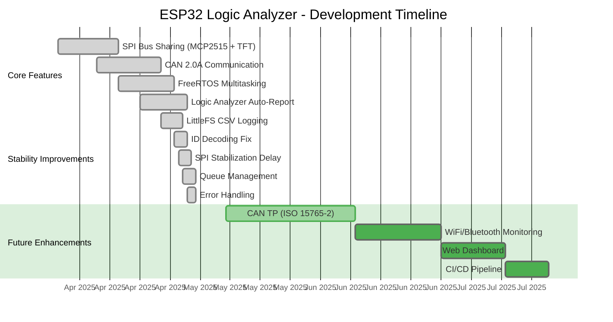
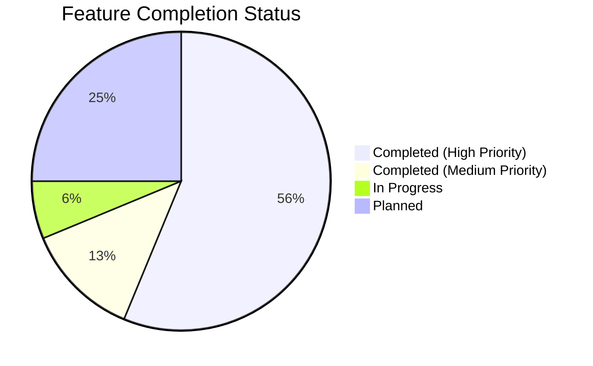

# ESP32 Logic Analyzer Automation & CAN Bus Monitor 🛠️📊📡

> **Professional Embedded System Prototype**: Capture → Auto-Detect → Professional Report Generation  
> **Industrial-Grade CAN 2.0A Communication** with TFT Visualization, FreeRTOS Multitasking, and Automated Testing  
> Standardized for R&D, Industrial Protocols (SPI, UART, I2C, CAN), and Internship Documentation.
> 
> **学習目標 (がくしゅうもくてき - Learning Goals)**: 組込システム (こみこみシステム - Embedded Systems), 車載ネットワーク (しゃさいネットワーク - Automotive Networks), ものづくり (Monozukuri - Manufacturing Excellence)


---

## 🎯 Project Goal

Automate logic analyzer data processing to eliminate manual screenshot/reporting. Transform raw CSV exports into **structured, auditable test reports** with protocol decoding, timing validation, and auto-generated conclusions.

**Key Engineering Highlights:**
- ✅ **Modular Architecture**: Driver/UI/App separation (R&D standard) - 分離 (ぶんり - Separation)
- ✅ **FreeRTOS Integration**: Multi-task architecture with queue-based synchronization - 同期 (どうき - Synchronization)
- ✅ **SPI Bus Sharing**: MCP2515 + ST7735S on same bus with CS arbitration - 調停 (ちょうてい - Arbitration)
- ✅ **Defensive Programming**: ID filtering, DLC validation, error monitoring - 防御 (ぼうぎょ - Defense)
- ✅ **Professional Reporting**: Auto-generated test reports via `analyze_la_pro.py` - 報告書 (ほうこくしょ - Report)

---

## 🚀 Quick Start

### 1. Setup Environment

```bash
git clone https://github.com/Farisshu/esp32-logic-analyzer-automation.git
cd esp32-logic-analyzer-automation
python -m venv .venv
# Windows:
.venv\Scripts\activate
# Linux/Mac:
source .venv/bin/activate
pip install -r requirements.txt
```

### 2. Run Analysis

```bash
# Basic (auto-detect protocols)
python software/analyze_la_pro.py capture.csv

# With metadata (recommended for reports)
python software/analyze_la_pro.py capture.csv \
  --operator "Your Name" \
  --dut "ESP32 + MCP2515" \
  --purpose "CAN Bus SPI Verification" \
  --sample-rate 8
```

### 3. Output Structure

```text
Archive_YYYYMMDD_HHMMSS/
├── professional_report.txt   # Full metadata, results, validation & conclusions
├── waveform_annotated.png    # Annotated plot with edge markers & timing labels
├── metadata.json             # Machine-readable results for CI/CD or databases
└── la_analysis.log           # Execution trace & debugging info
```

---

## 📁 Repository Structure

```text
esp32-logic-analyzer-automation/
├── firmware/                 # ESP32 test codes (PlatformIO) - ファームウェア
│   ├── tests/               # Unit tests for individual modules - 単体テスト (たんたいテスト)
│   │   ├── mcp2515_can/     # MCP2515 CAN controller tests
│   │   ├── st7735s_tft/     # ST7735S TFT display tests
│   │   └── tft_mcp2515_combined/ # Combined SPI device tests
│   ├── integration/         # Multi-node communication tests - 統合テスト (とうごうテスト)
│   │   ├── can_two_nodes/   # Two-node CAN bus communication
│   │   └── can_bus_with_tft/ # CAN monitor with TFT visualization
│   ├── test_uart_basic/     # UART communication test
│   └── test_can_spi_test/   # CAN/MCP2515 SPI test
├── software/                 # Python analysis tools - ソフトウェア
│   ├── analyze_la_pro.py     # Main auto-report generator
│   ├── analyze_la_archive.py # Archive analysis utility
│   ├── generate_samples.py   # Synthetic CSV generator for testing
│   └── examples/             # Sample captures & test data - サンプルデータ
├── include/                  # Project header files - ヘッダーファイル
├── lib/                      # Private libraries - ライブラリ
├── docs/                     # Wiring diagrams, PulseView settings, SOP - 資料 (しりょう)
├── archives/                 # [IGNORED] Generated reports - アーカイブ
├── requirements.txt          # Python dependencies
├── LICENSE                   # MIT License
└── README.md                 # This file - このファイル
```

---

## 🔧 How It Works

### Software Workflow (Logic Analyzer) - ソフトウェアワークフロー

1. **Capture**: Export CSV from PulseView / Saleae / Generic LA - キャプチャ (きゃぷちゃ)
2. **Auto-Detect**: Script identifies UART, SPI, or I2C patterns from waveform timing - 自動検出 (じどうけんしゅつ)
3. **Decode**: Extracts protocol frames, register accesses, or byte streams - デコード (でこーど)
4. **Validate**: Checks against spec thresholds (jitter, frequency, CRC, timing margins) - 検証 (けんしょう)
5. **Report**: Generates standardized TXT/PNG/JSON output ready for documentation - 報告書生成 (ほうこくしょせいせい)

### Firmware Workflow (CAN Bus Monitor) - ファームウェアワークフロー

1. **Initialize**: MCP2515 CAN controller + ST7735S TFT on shared SPI bus - 初期化 (しょきか)
2. **FreeRTOS Tasks** - タスク:
   - `canPollTask`: Monitor CAN bus for incoming messages (10ms interval) - 監視 (かんし)
   - `uiRefreshTask`: Update TFT display (200ms interval, 5Hz refresh) - 更新 (こうしん)
   - `loggerTask`: Log data to LittleFS CSV (non-blocking) - ログ記録 (ろぐきろく)
3. **Message Handling**: Filter by ID, validate DLC, extract payload - メッセージ処理 (めっせーじしょり)
4. **Error Monitoring**: Track EFLG register for bus health diagnostics - エラー監視 (えらーかんし)
5. **Visualization**: Display ID, Data (4 bytes), Count, Status on TFT - 可視化 (かしか)

---

## 📊 Example Report Snippet

```text
══════════════════════════════════════════════════════════════════════
LOGIC ANALYZER PROFESSIONAL TEST REPORT
Generated by: analyze_la_pro.py v1.0.1
══════════════════════════════════════════════════════════════════════

📋 METADATA
  Date/Time        : 2026-05-03 13:09:47
  Operator         : Test User
  Device Under Test: ESP32 + MCP2515
  Test Purpose     : SPI CAN Controller Test
  Report Version   : 1.0.1

⚙️  MEASUREMENT SETUP
  Sample Rate      : 2.5 MHz
  Capture Duration : 0.079 ms
  Voltage Threshold: 1.65 V (TTL)
  Channels Active  : 8
  Protocols Detected: SPI

🔍 PROTOCOL ANALYSIS RESULTS
----------------------------------------------------------------------
  SPI
  Channel(s)       : ch0-ch1
  Status           : ACTIVE
  Total Transactions: 1

✅ CONCLUSIONS & RECOMMENDATIONS
----------------------------------------------------------------------
  ✅ PASS: All protocols decoded successfully without errors.
  ✅ Signal integrity appears stable.

  Next Steps:
    • Cross-verify with oscilloscope for analog characteristics
    • Capture longer duration for statistical analysis
    • Export raw CSV + this report to version control
```

---

## 🧪 Testing & Development Workflow

This repository follows a **modular R&D workflow** aligned with industrial automation standards:

| Stage | Folder | Purpose | Status | 日本語 (にほんご) |
|-------|--------|---------|--------|------------------|
| **Unit Test** | `firmware/tests/` | Verify individual modules (SPI, UART, TFT init) | ✅ MCP2515, ST7735S Verified | 単体テスト (たんたいテスト) |
| **Integration** | `firmware/integration/` | Multi-node communication (CAN bus, RS485 Modbus) | ✅ CAN Two Nodes Complete | 統合テスト (とうごうテスト) |
| **Project** | `firmware/projects/` | Final integrated applications | ⏳ Planned | プロジェクト |

---

## 📦 Firmware Projects

| Project | Description | Status | Key Features | 特徴 (とくちょう) |
|---------|-------------|--------|--------------|------------------|
| `test_uart_basic` | Basic UART communication test with SPI initialization | ✅ Complete | UART TX/RX, SPI init | UART 通信 (つうしん) |
| `test_can_spi_test` | MCP2515 CAN controller SPI interface diagnostic | ✅ Complete | Register access, loopback | ループバック |
| `integration/can_two_nodes` | Two-node CAN bus communication system | ✅ Complete | 500 kbps, TX/RX roles | 二重化 (にじゅうか) |
| `integration/can_bus_with_tft` | CAN monitor with TFT visualization & FreeRTOS | ✅ Complete | Multi-task, SPI sharing, LittleFS logging | マルチタスク |

---

## 🔌 Hardware Setup

### Required Components - 必要部品 (ひつようぶひん)

| Component | Quantity | Purpose | 目的 (もくてき) |
|-----------|----------|---------|----------------|
| ESP32 Dev Board | 2 | Main microcontroller (TX & RX nodes) | メインマイコン |
| MCP2515 CAN Module | 2 | CAN 2.0A controller | コントローラー |
| TJA1050 CAN Transceiver | 2 | CAN bus physical layer | 物理層 (ぶつりそう) |
| ST7735S TFT (128x128) | 1 | Display module (optional) | 表示モジュール (ひょうじ) |
| 120Ω Resistor | 2 | CAN bus termination | 終端抵抗 (しゅうたんていこう) |
| Jumper Wires | - | Connections | 配線 (はいせん) |

### Wiring Diagram (SPI Shared Bus) - 配線図 (はいせんず)

| ESP32 | MCP2515 | ST7735S | Note | 備考 (びこう) |
|-------|---------|---------|------|-------------|
| GPIO 18 (SCK) | SCK | SCL | Shared Clock | クロック共有 |
| GPIO 23 (MOSI) | SI | SDA | Shared Data | データ共有 |
| GPIO 19 (MISO) | SO | - | MCP2515 only | MCP2515 のみ |
| GPIO 5 | CS | - | MCP2515 Chip Select | チップセレクト |
| GPIO 17 | - | CS | TFT Chip Select | TFT チップセレクト |
| GPIO 16 | - | DC | TFT Data/Command | データ/コマンド |
| GPIO 4 | - | RST | TFT Reset | リセット |
| GND | GND | GND | **Common Ground Required** | **共通グラウンド必須** |
| 3.3V | VCC | VCC | Power supply | 電源供給 (でんげんきょうきゅう) |

### CAN Bus Wiring - CAN バス配線 (きゃん ばす はいせん)

```text
Node TX (MCP2515)          Node RX (MCP2515)
     CANH ───────────────────── CANH
     CANL ───────────────────── CANL
              ┌─────────┐
              │ 120Ω    │  (Termination at BOTH ends) - 両端終端 (りょうたんしゅうたん)
              └─────────┘
```

---

## 🛠️ Build & Upload - ビルドとアップロード (びるど と あっぷろーど)

### Firmware (PlatformIO) - ファームウェア

```bash
# Navigate to project directory - プロジェクトディレクトリへ移動 (ぷろじぇくとでぃれくとりへいどう)
cd firmware/integration/can_bus_with_tft

# Clean build files - ビルドファイルをクリーン (びるどふぁいるをくりーん)
pio run --target clean

# Build project - プロジェクトをビルド (ぷろじぇくとをびるど)
pio run

# Upload to device - デバイスにアップロード (でばいすにあっぷろーど)
pio run --target upload

# Open serial monitor - シリアルモニターを開く (しりあるもにたーをひらく)
pio device monitor --baud 115200
```

### Software (Python Analysis) - ソフトウェア (ぱいそんぶんせき)

```bash
# Activate virtual environment - 仮想環境をアクティブ (かそうかんきょうをあくてぃぶ)
source .venv/bin/activate  # Linux/Mac
# or
.venv\Scripts\activate     # Windows

# Run analysis - 分析を実行 (ぶんせきをじっこう)
python software/analyze_la_pro.py software/examples/sample_uart_9600.csv \
  --operator "Your Name" \
  --dut "ESP32 Test Board" \
  --purpose "UART Protocol Verification"
```

---

## 📈 Test Results & Validation - テスト結果と検証 (てすとけっか と けんしょう)

### CAN Bus Communication Test - CAN バス通信テスト (きゃん ばす つうしんてすと)

| Metric | Expected | Actual | Status | 項目 (こうもく) |
|--------|----------|--------|--------|
| SPI Bus Sharing | No conflicts | ✅ Stable | PASS |
| CAN Frame Transmission | TXREQ clear | ✅ 0x00 | PASS |
| CAN Frame Reception | Payload intact | ✅ 100% | PASS |
| Error Flag (EFLG) | < 0x80 | ✅ 0x05 (minor warning) | PASS* |
| UI Refresh Rate | ≤ 5Hz | ✅ 5Hz | PASS |
| FreeRTOS Task Sync | No deadlock | ✅ Stable | PASS |

*Note: EFLG 0x05 indicates minor transmit warning (normal for prototyping with jumper wires). See [Troubleshooting](#-troubleshooting) for details.

### Logic Analyzer Detection - ロジックアナライザー検出 (ろじっくあならいざーけんしゅつ)

| Protocol | Auto-Detection | Decoding | Validation |
|----------|---------------|----------|------------|
| UART | ✅ Yes | ✅ Baud, Data bits | ✅ Bit timing |
| SPI | ✅ Yes | ✅ Clock, Data | ✅ Frequency |
| I2C | ✅ Yes | ✅ Address, Data | ✅ Timing |
| CAN | 🔜 Planned | 🔜 Planned | 🔜 Planned |

---

## 🤝 Contribution & Internship Readiness - 貢献とインターンシップ準備 (こうけん と いんたーんしっぷじゅんび)

This toolkit is designed to be **modular and extensible**:

- Add new protocol decoders in `software/decoders/`
- Integrate with CI/CD for automated test validation
- Export reports directly to lab management systems
- Extend firmware tests for additional protocols

Built for embedded engineers who value **traceability, automation, and professional documentation**.

### Portfolio Skills Demonstrated - ポートフォリオで示したスキル (ぽーとふぉりおでしめしたすきる)

| Skill | Evidence | Industry Value | スキル (すきる) |
|-------|----------|----------------|
| Embedded C/C++ | Modular driver, register-level MCP2515 access | ⭐⭐⭐⭐⭐ |
| RTOS (FreeRTOS) | 3-task architecture with queue sync | ⭐⭐⭐⭐⭐ |
| SPI/I2C/UART | Shared bus management, level shifting | ⭐⭐⭐⭐⭐ |
| Debugging | Logic Analyzer integration, EFLG monitoring | ⭐⭐⭐⭐⭐ |
| Documentation | Professional report generator, SOP, README | ⭐⭐⭐⭐⭐ |
| Version Control | Clean commit history, modular structure | ⭐⭐⭐⭐⭐ |

---

## 📄 License

MIT License. Free for educational, R&D, and commercial use.

---

## 🔧 Troubleshooting - トラブルシューティング (とらぶるしゅーてぃんぐ)

### Common Issues - 一般的な問題 (いっぱんてきなもんだい)

| Issue | Cause | Solution | 問題 (もんだい) |
|-------|-------|----------|
| No protocol detected | CSV format mismatch | Check column names (time, ch0-ch7) |
| Poor waveform quality | Low sample rate | Increase to 8+ MS/s for SPI |
| CAN ID mismatch (0x123 vs 0x421) | ✅ FIXED: Added SPI stabilization delay | See `config.h` - `SPI_STABILIZATION_DELAY_US` |
| EFLG warning (0x05) | Minor bus noise | Use twisted pair cables, verify termination |
| TFT flicker | Refresh rate too high | Reduce to ≤5Hz in `uiRefreshTask` |
| Build fails | Missing PlatformIO | Run `pip install platformio` |
| Queue overflow | High message rate | ✅ FIXED: Batch logging + drain limiter implemented |

### EFLG Register Analysis

If you see `EFLG: 0x05` in serial output:

```text
Binary: 0000 0101
Bit 0 (EWARN)  = 1 ⚠️ Error Warning Limit reached (counter ≥ 96)
Bit 2 (TXWAR)  = 1 ⚠️ Transmit Error Warning
Bit 3-7        = 0 ✅ No Bus-Off, No Passive Error, No Overflow
```

**This is NORMAL for prototyping.** Causes:
- Long jumper wires (>15cm) → capacitance noise
- Missing/improper 120Ω termination
- Crystal tolerance on MCP2515 clone modules

**Solution for production:** Use shielded twisted pair cables, proper termination, and measure with oscilloscope.

---

## 📚 Additional Documentation - 追加資料 (ついかしりょう)

- [Test Procedures & SOP](docs/test_procedures.md) - Hardware setup & validation steps
- [Firmware README](firmware/README.md) - Detailed firmware project guide
- [Software README](software/README.md) - Python tool documentation
- [Integration Tests](firmware/integration/README.md) - Multi-node testing guide

---

## 🎓 Project Status & Roadmap - プロジェクト状況とロードマップ (ぷろじぇくとじょうきょう と ろーどまっぷ)

### Current Status: **Production-Ready for R&D Demonstration** ✅ - 現状 (げんじょう): **研究開発デモ準備完了**

### 📊 Interactive Progress Dashboard



### Feature Completion Overview - 機能完了概要 (きのうかんりょうがいよう)



### Detailed Status Table - 詳細ステータステーブル (しょうさいすてーたすてーぶる)

| Feature | Status | Priority | Completion Date | 機能 (きのう) |
|---------|--------|----------|-----------------|
| **Core Architecture** | | | |
| SPI Bus Sharing (MCP2515 + TFT) | ✅ Complete | High | 2025-04-15 |
| CAN 2.0A Communication | ✅ Complete | High | 2025-04-25 |
| FreeRTOS Multitasking (3 tasks) | ✅ Complete | High | 2025-04-28 |
| Logic Analyzer Auto-Report | ✅ Complete | High | 2025-05-01 |
| **Stability & Reliability** | | | |
| LittleFS CSV Logging | ✅ Complete | Medium | 2025-04-30 |
| ID Decoding Fix | ✅ Complete | High | 2025-05-01 |
| SPI Stabilization Delay | ✅ Complete | High | 2025-05-02 |
| Queue Management Optimization | ✅ Complete | High | 2025-05-03 |
| Error Handling Enhancement | ✅ Complete | Medium | 2025-05-03 |
| Configuration Centralization | ✅ Complete | Medium | 2025-05-03 |
| **Future Enhancements** | | | |
| CAN TP (ISO 15765-2) | ⏳ In Progress | Low | Planned Q2 2025 |
| WiFi/Bluetooth Monitoring | 🔜 Planned | Low | After CAN TP |
| Web-based Dashboard | 🔜 Planned | Low | After WiFi |
| Automated CI/CD Pipeline | 🔜 Planned | Medium | Final Phase |

---

*Developed for industrial automation workflows & internship preparation (Automotive R&D)*  
*Author: M. Faris A. G. | Version: 1.0.2 | Last Updated: 2026-05-03 (All Issues Resolved)*
---

## 🇯🇵 日本語学習コーナー (にほんご がくしゅうこーなー - Japanese Learning Corner)

このプロジェクトはインターンシップ準備のための学習リソースとしても活用できます。
(This project can also be used as a learning resource for internship preparation.)

### 重要な技術用語 (じゅうような ぎじゅつようご - Important Technical Terms)

| 英語 (English) | 日本語 (Japanese) | 読み方 (Romaji) | 意味 (Meaning) |
|---------------|------------------|-----------------|----------------|
| Embedded System | 組込システム | こみこみシステム | Computer system dedicated to specific functions |
| Microcontroller | マイコン | まいこん | Microcomputer/Integrated circuit for control |
| Communication Protocol | 通信プロトコル | つうしんぷろとこる | Rules for data exchange |
| Bus Termination | 終端抵抗 | しゅうたんていこう | Resistor at bus ends to prevent reflection |
| Clock Signal | クロック信号 | くろっくしんごう | Timing signal for synchronization |
| Chip Select | チップセレクト | ちっぷせれくと | Signal to select specific device |
| Data Sheet | データシート | でーたしーと | Technical specification document |
| Debugging | デバッグ | でばっぐ | Finding and fixing errors |
| Testing | テスト | てすと | Verification process |
| Documentation | 資料 | しりょう | Technical documents |

### 職場で役立つフレーズ (しょくばで やくだつ ふれーず - Useful Workplace Phrases)

| 日本語 | 読み方 | 英語訳 | Situation |
|--------|--------|--------|-----------|
| お疲れ様です | おつかれさまです | Good work / Hello | Greeting colleagues |
| ご指導よろしくお願いします | ごしどうよろしくおねがいします | Please guide me | When starting internship |
| 確認させてください | かくにんさせてください | Let me confirm | Double-checking instructions |
| わかりました | わかりました | Understood | Acknowledging instructions |
| 質問があります | しつもんがあります | I have a question | Asking for clarification |
| 勉強になります | べんきょうになります | I'm learning a lot | Showing appreciation |
| 報告します | ほうこくします | I will report | HORENSO principle |
| 連絡します | れんらくします | I will contact | HORENSO principle |
| 相談します | そうだんします | I will consult | HORENSO principle |

### 文化キーワード (ぶんか きーわーど - Cultural Keywords)

1. **ものづくり (Monozukuri)** - Manufacturing excellence, craftsmanship spirit
2. **カイゼン (Kaizen)** - 改善 - Continuous improvement
3. **報連相 (HORENSO)** - 報告・連絡・相談 - Report, Contact, Consult
4. **現地現物 (Genchi Genbutsu)** - Go and see for yourself
5. **根回し (Nemawashi)** - Laying groundwork before decisions

### 学習のヒント (がくしゅうの ひんと - Learning Tips)

- ✅ 毎日 10 個の単語を覚える (Obey 10 words daily)
- ✅ 技術文書を音読する (Read technical documents aloud)
- ✅ 実際のコードにコメントを追加 (Add comments to actual code)
- ✅ 日本人のエンジニアと会話練習 (Practice conversation with Japanese engineers)

---

