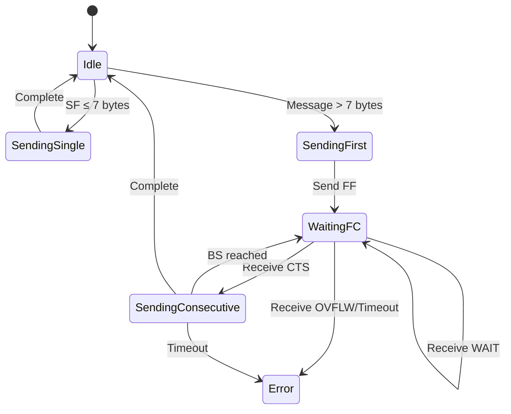
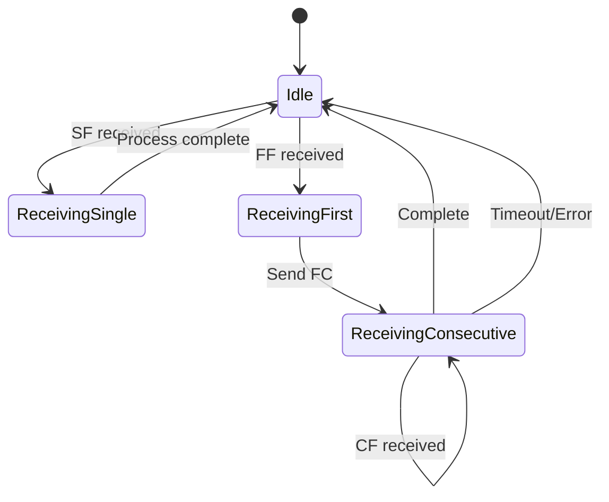

# 🚗 CAN Transport Protocol (ISO 15765-2)
## Deep Dive Implementation Guide

---

### 📋 Quick Reference

| Attribute | Value |
|-----------|-------|
| **Standard** | ISO 15765-2 / ISO 14229 |
| **Layer** | Transport Layer (Layer 4) |
| **Max Payload** | 4095 bytes |
| **Frame Size** | 8 bytes (CAN 2.0A) |
| **Prerequisites** | CAN Bus 2.0, Basic C/C++ |
| **Difficulty** | ⭐⭐⭐ Intermediate |
| **Japanese** | CAN トランスポートプロトコル (KAN Toransupōto Purotokoru) |

---

## 🎯 Learning Objectives

Setelah mempelajari materi ini, Anda akan mampu:
1. ✅ Memahami keterbatasan CAN frame dan kebutuhan TP
2. ✅ Menjelaskan 4 jenis frame TP (SF, FF, CF, FC)
3. ✅ Mengimplementasikan state machine untuk TP
4. ✅ Mengelola buffer dan sequence numbering
5. ✅ Menangani flow control dan timeout
6. ✅ Debug masalah umum dalam implementasi TP

---

## 1. Introduction: Why CAN TP?

### 1.1 The Problem

CAN 2.0A memiliki keterbatasan fundamental:
- **Maximum Data Length**: 8 bytes per frame
- **UDS Messages**: Bisa mencapai 4095 bytes

```
┌─────────────────────────────────────┐
│  UDS Request: Read VIN Number       │
│  Total Size: 15 bytes               │
│                                     │
│  [0x02][0x22][0xF1][0x90] + ...     │
│                                     │
│  ❌ TIDAK MUAT dalam 1 CAN Frame!   │
└─────────────────────────────────────┘
```

### 1.2 The Solution: ISO 15765-2

CAN TP memecah pesan besar menjadi beberapa frame kecil:

```
Original Message (15 bytes):
[02 22 F1 90 00 00 00 00 00 00 00 00 00 00 00]

Split into:
┌──────────────┬──────────────┬──────────────┐
│ First Frame  │ Consecutive  │ Consecutive  │
│ (7 bytes)    │ Frame #1     │ Frame #2     │
│ [FF 0F 00...]│ [2E 00 00...]│ [3E 00 00...]│
└──────────────┴──────────────┴──────────────┘
```

---

## 2. Frame Types Explained

### 2.1 Single Frame (SF)

Digunakan untuk pesan ≤ 7 bytes.

| Byte | Content | Description |
|------|---------|-------------|
| 0 | PCI Type (0x0X) | X = data length (0-7) |
| 1-7 | Data | Payload data |

**Example:**
```
Message: [0x02][0x22][0xF1][0x90]
         └─┬─┘ └────── UDS Data ──────┘
           │
           └─ Single Frame, 2 bytes
```

### 2.2 First Frame (FF)

Frame pertama untuk pesan > 7 bytes.

| Byte | Content | Description |
|------|---------|-------------|
| 0 | PCI Type (0x1X) | X = MSB of length |
| 1 | Length LSB | Total message length (0-4095) |
| 2-7 | Data | First 6 bytes of payload |

**Structure:**
```
[1F 0C XX XX XX XX XX XX]
 │  │  └─────────────────┘
 │  │    First 6 bytes of data
 │  └─ Total length = 0x0F0C = 3852 bytes
 └─ First Frame indicator
```

### 2.3 Consecutive Frame (CF)

Frame lanjutan setelah FF.

| Byte | Content | Description |
|------|---------|-------------|
| 0 | PCI Type (0x2N) | N = Sequence number (1-15) |
| 1-7 | Data | Next 7 bytes of payload |

**Sequence Flow:**
```
FF → CF#1 → CF#2 → CF#3 → ... → CF#15 → CF#1 → CF#2...
(Squence number wraps after 15)
```

### 2.4 Flow Control (FC)

Frame kontrol dari receiver ke sender.

| Byte | Content | Description |
|------|---------|-------------|
| 0 | PCI Type (0x3X) | X = Flow status |
| 1 | Block Size (BS) | Max CF before next FC |
| 2 | Separation Time (STmin) | Min delay between frames |

**Flow Status Values:**
| Value | Status | Action |
|-------|--------|--------|
| 0x00 | Continue to Send (CTS) | Sender boleh lanjut |
| 0x01 | Wait (WAIT) | Sender harus tunggu |
| 0x03 | Overflow (OVFLW) | Buffer penuh, error |

---

## 3. State Machine Design

### 3.1 Sender State Machine



### 3.2 Receiver State Machine



---

## 4. Data Structures (C Implementation)

### 4.1 Core Structures

```c
/**
 * @brief CAN TP Frame Types
 */
typedef enum {
    TP_FRAME_SINGLE      = 0x00,
    TP_FRAME_FIRST       = 0x10,
    TP_FRAME_CONSECUTIVE = 0x20,
    TP_FRAME_FLOW_CTRL   = 0x30
} tp_frame_type_t;

/**
 * @brief Flow Control Status
 */
typedef enum {
    FC_CTS    = 0x00,  ///< Continue to Send
    FC_WAIT   = 0x01,  ///< Wait
    FC_OVERFLOW = 0x03 ///< Overflow
} fc_status_t;

/**
 * @brief TP Session States
 */
typedef enum {
    TP_STATE_IDLE,
    TP_STATE_SENDING_SF,
    TP_STATE_SENDING_FF,
    TP_STATE_WAITING_FC,
    TP_STATE_SENDING_CF,
    TP_STATE_RECEIVING_FF,
    TP_STATE_RECEIVING_CF
} tp_state_t;

/**
 * @brief TP Configuration
 */
typedef struct {
    uint32_t can_id_tx;        ///< Transmit CAN ID
    uint32_t can_id_rx;        ///< Receive CAN ID
    uint16_t max_message_len;  ///< Maximum message length (default: 4095)
    uint8_t  block_size;       ///< Block size for FC (0 = unlimited)
    uint8_t  st_min_ms;        ///< Separation time in ms
    uint32_t timeout_ms;       ///< Communication timeout
} tp_config_t;

/**
 * @brief TP Session Context
 */
typedef struct {
    tp_state_t state;                  ///< Current state
    uint8_t tx_buffer[4096];           ///< Transmit buffer
    uint8_t rx_buffer[4096];           ///< Receive buffer
    uint16_t tx_total_len;             ///< Total transmit length
    uint16_t rx_total_len;             ///< Total receive length
    uint16_t tx_bytes_sent;            ///< Bytes sent so far
    uint16_t rx_bytes_received;        ///< Bytes received so far
    uint8_t  tx_sequence_number;       ///< Current TX sequence number
    uint8_t  rx_expected_sequence;     ///< Expected RX sequence number
    uint8_t  fc_block_counter;         ///< Remaining frames in block
    uint32_t last_activity_time;       ///< Last activity timestamp
    bool     is_busy;                  ///< Session busy flag
} tp_session_t;
```

---

## 5. Core Functions Implementation

### 5.1 Initialize TP Session

```c
/**
 * @brief Initialize CAN TP session
 * @param session Pointer to session structure
 * @param config Pointer to configuration
 * @return 0 on success, -1 on error
 */
int tp_session_init(tp_session_t *session, const tp_config_t *config) {
    if (session == NULL || config == NULL) {
        return -1;
    }
    
    memset(session, 0, sizeof(tp_session_t));
    session->state = TP_STATE_IDLE;
    session->is_busy = false;
    
    // Validate configuration
    if (config->max_message_len > 4095) {
        return -1;
    }
    
    return 0;
}
```

### 5.2 Send Message (Main API)

```c
/**
 * @brief Send message via CAN TP
 * @param session TP session context
 * @param data Pointer to data buffer
 * @param length Data length
 * @return 0 on success, -1 on error
 */
int tp_send(tp_session_t *session, const uint8_t *data, uint16_t length) {
    if (session == NULL || data == NULL || length == 0) {
        return -1;
    }
    
    if (length > 4095) {
        return -1;  // Exceeds maximum TP length
    }
    
    if (session->is_busy) {
        return -1;  // Session already busy
    }
    
    // Copy data to transmit buffer
    memcpy(session->tx_buffer, data, length);
    session->tx_total_len = length;
    session->tx_bytes_sent = 0;
    session->is_busy = true;
    
    if (length <= 7) {
        // Single Frame
        session->state = TP_STATE_SENDING_SF;
        return tp_send_single_frame(session);
    } else {
        // First Frame + Consecutive Frames
        session->state = TP_STATE_SENDING_FF;
        return tp_send_first_frame(session);
    }
}

/**
 * @brief Send Single Frame
 */
static int tp_send_single_frame(tp_session_t *session) {
    uint8_t can_data[8];
    
    // PCI byte: 0x0X where X = length
    can_data[0] = (uint8_t)(session->tx_total_len & 0x0F);
    
    // Copy data (max 7 bytes)
    memcpy(&can_data[1], session->tx_buffer, session->tx_total_len);
    
    // Pad remaining bytes with 0xCC (common practice)
    for (int i = session->tx_total_len + 1; i < 8; i++) {
        can_data[i] = 0xCC;
    }
    
    // Send CAN frame (implement according to your CAN driver)
    can_send_frame(can_data, 8);
    
    session->tx_bytes_sent = session->tx_total_len;
    session->state = TP_STATE_IDLE;
    session->is_busy = false;
    
    return 0;
}

/**
 * @brief Send First Frame
 */
static int tp_send_first_frame(tp_session_t *session) {
    uint8_t can_data[8];
    
    // PCI byte: 0x1X where X = MSB of length
    can_data[0] = 0x10 | ((session->tx_total_len >> 8) & 0x0F);
    
    // Length LSB
    can_data[1] = (uint8_t)(session->tx_total_len & 0xFF);
    
    // First 6 bytes of data
    memcpy(&can_data[2], session->tx_buffer, 6);
    session->tx_bytes_sent = 6;
    
    // Set sequence number for next CF
    session->tx_sequence_number = 1;
    
    // Send First Frame
    can_send_frame(can_data, 8);
    
    // Transition to waiting for Flow Control
    session->state = TP_STATE_WAITING_FC;
    session->last_activity_time = get_current_time_ms();
    
    return 0;
}
```

### 5.3 Receive and Process Frames

```c
/**
 * @brief Process received CAN frame
 * @param session TP session context
 * @param can_data Received CAN data (8 bytes)
 * @return 0 on success, -1 on error
 */
int tp_receive_frame(tp_session_t *session, const uint8_t *can_data) {
    if (session == NULL || can_data == NULL) {
        return -1;
    }
    
    session->last_activity_time = get_current_time_ms();
    
    uint8_t pci_type = can_data[0] & 0xF0;
    
    switch (pci_type) {
        case TP_FRAME_SINGLE:
            return tp_process_single_frame(session, can_data);
            
        case TP_FRAME_FIRST:
            return tp_process_first_frame(session, can_data);
            
        case TP_FRAME_CONSECUTIVE:
            return tp_process_consecutive_frame(session, can_data);
            
        case TP_FRAME_FLOW_CTRL:
            return tp_process_flow_control(session, can_data);
            
        default:
            return -1;  // Invalid frame type
    }
}

/**
 * @brief Process Flow Control frame (Sender side)
 */
static int tp_process_flow_control(tp_session_t *session, const uint8_t *can_data) {
    uint8_t fs = can_data[0] & 0x0F;
    uint8_t bs = can_data[1];
    uint8_t st_min = can_data[2];
    
    switch (fs) {
        case FC_CTS:
            // Continue sending
            session->fc_block_counter = bs;
            session->state = TP_STATE_SENDING_CF;
            return tp_send_next_consecutive_frame(session);
            
        case FC_WAIT:
            // Stay in waiting state
            session->state = TP_STATE_WAITING_FC;
            return 0;
            
        case FC_OVERFLOW:
            // Error: receiver buffer overflow
            session->state = TP_STATE_IDLE;
            session->is_busy = false;
            return -1;
            
        default:
            return -1;
    }
}

/**
 * @brief Send next Consecutive Frame
 */
static int tp_send_next_consecutive_frame(tp_session_t *session) {
    if (session->tx_bytes_sent >= session->tx_total_len) {
        // All data sent
        session->state = TP_STATE_IDLE;
        session->is_busy = false;
        return 0;
    }
    
    uint8_t can_data[8];
    
    // PCI byte: 0x2N where N = sequence number
    can_data[0] = 0x20 | (session->tx_sequence_number & 0x0F);
    
    // Calculate how many bytes to send
    uint16_t remaining = session->tx_total_len - session->tx_bytes_sent;
    uint8_t bytes_to_send = (remaining > 7) ? 7 : (uint8_t)remaining;
    
    // Copy data
    memcpy(&can_data[1], 
           &session->tx_buffer[session->tx_bytes_sent], 
           bytes_to_send);
    
    // Pad if needed
    for (int i = bytes_to_send + 1; i < 8; i++) {
        can_data[i] = 0xCC;
    }
    
    // Send frame
    can_send_frame(can_data, 8);
    
    // Update counters
    session->tx_bytes_sent += bytes_to_send;
    session->tx_sequence_number++;
    if (session->tx_sequence_number > 15) {
        session->tx_sequence_number = 1;  // Wrap around
    }
    
    // Check if block complete
    if (session->fc_block_counter > 0) {
        session->fc_block_counter--;
        if (session->fc_block_counter == 0 && session->tx_bytes_sent < session->tx_total_len) {
            // Need new Flow Control
            session->state = TP_STATE_WAITING_FC;
        }
    }
    
    return 0;
}
```

### 5.4 Receive Side Implementation

```c
/**
 * @brief Process First Frame (Receiver side)
 */
static int tp_process_first_frame(tp_session_t *session, const uint8_t *can_data) {
    if (session->is_busy) {
        return -1;  // Already receiving
    }
    
    // Extract total length
    uint16_t total_len = ((can_data[0] & 0x0F) << 8) | can_data[1];
    
    if (total_len == 0 || total_len > 4095) {
        return -1;  // Invalid length
    }
    
    session->rx_total_len = total_len;
    session->rx_bytes_received = 6;  // First 6 bytes in FF
    
    // Copy first 6 bytes
    memcpy(session->rx_buffer, &can_data[2], 6);
    
    // Expect sequence number 1
    session->rx_expected_sequence = 1;
    
    // Send Flow Control (CTS)
    uint8_t fc_frame[8] = {0x30, 0x00, 0x00, 0xCC, 0xCC, 0xCC, 0xCC, 0xCC};
    // BS = 0 (unlimited), STmin = 0
    can_send_frame(fc_frame, 8);
    
    session->state = TP_STATE_RECEIVING_CF;
    session->is_busy = true;
    session->last_activity_time = get_current_time_ms();
    
    return 0;
}

/**
 * @brief Process Consecutive Frame (Receiver side)
 */
static int tp_process_consecutive_frame(tp_session_t *session, const uint8_t *can_data) {
    if (session->state != TP_STATE_RECEIVING_CF) {
        return -1;  // Not expecting CF
    }
    
    // Check sequence number
    uint8_t seq_num = can_data[0] & 0x0F;
    if (seq_num != session->rx_expected_sequence) {
        return -1;  // Sequence mismatch
    }
    
    // Calculate bytes to copy
    uint16_t remaining = session->rx_total_len - session->rx_bytes_received;
    uint8_t bytes_to_copy = (remaining > 7) ? 7 : (uint8_t)remaining;
    
    // Copy data
    memcpy(&session->rx_buffer[session->rx_bytes_received],
           &can_data[1],
           bytes_to_copy);
    
    session->rx_bytes_received += bytes_to_copy;
    session->rx_expected_sequence++;
    if (session->rx_expected_sequence > 15) {
        session->rx_expected_sequence = 1;  // Wrap around
    }
    
    session->last_activity_time = get_current_time_ms();
    
    // Check if complete
    if (session->rx_bytes_received >= session->rx_total_len) {
        session->state = TP_STATE_IDLE;
        session->is_busy = false;
        
        // Notify application: message complete
        tp_on_message_complete(session, session->rx_buffer, session->rx_total_len);
        return 0;
    }
    
    return 0;
}
```

### 5.5 Timeout Handling

```c
/**
 * @brief Check for communication timeout
 * @param session TP session context
 * @param current_time_ms Current timestamp in milliseconds
 * @return 0 if OK, -1 if timeout occurred
 */
int tp_check_timeout(tp_session_t *session, uint32_t current_time_ms) {
    if (session->state == TP_STATE_IDLE) {
        return 0;  // No timeout check needed
    }
    
    uint32_t elapsed = current_time_ms - session->last_activity_time;
    
    if (elapsed > 2000) {  // 2 seconds timeout (ISO standard)
        // Timeout occurred
        session->state = TP_STATE_IDLE;
        session->is_busy = false;
        
        // Reset buffers
        memset(session->tx_buffer, 0, sizeof(session->tx_buffer));
        memset(session->rx_buffer, 0, sizeof(session->rx_buffer));
        
        return -1;  // Timeout error
    }
    
    return 0;  // OK
}
```

---

## 6. Complete Usage Example

### 6.1 Initialization and Configuration

```c
// Global TP session
tp_session_t g_tp_session;
tp_config_t g_tp_config;

void app_init(void) {
    // Configure TP parameters
    g_tp_config.can_id_tx = 0x7DF;  // OBD-II broadcast
    g_tp_config.can_id_rx = 0x7E8;  // ECU response
    g_tp_config.max_message_len = 4095;
    g_tp_config.block_size = 0;     // Unlimited
    g_tp_config.st_min_ms = 0;      // No delay
    g_tp_config.timeout_ms = 2000;  // 2 seconds
    
    // Initialize session
    if (tp_session_init(&g_tp_session, &g_tp_config) != 0) {
        // Handle initialization error
        while(1);
    }
    
    // Initialize CAN hardware
    can_init(g_tp_config.can_id_tx, g_tp_config.can_id_rx);
}
```

### 6.2 Main Loop Integration

```c
void app_main_loop(void) {
    uint8_t can_frame[8];
    
    while (1) {
        // Check for received CAN frames
        if (can_receive(can_frame)) {
            tp_receive_frame(&g_tp_session, can_frame);
        }
        
        // Check for timeouts
        tp_check_timeout(&g_tp_session, get_current_time_ms());
        
        // Other application tasks...
        vTaskDelay(pdMS_TO_TICKS(10));
    }
}
```

### 6.3 Sending UDS Request via TP

```c
void request_vin_number(void) {
    // UDS: Read Data By Identifier (VIN = 0xF190)
    uint8_t uds_request[] = {0x02, 0x22, 0xF1, 0x90};
    
    int result = tp_send(&g_tp_session, uds_request, sizeof(uds_request));
    
    if (result == 0) {
        printf("UDS request sent successfully\n");
    } else {
        printf("Failed to send UDS request\n");
    }
}
```

### 6.4 Callback for Complete Message

```c
/**
 * @brief Called when complete message is received
 */
void tp_on_message_complete(tp_session_t *session, 
                           uint8_t *data, 
                           uint16_t length) {
    printf("Received complete message: %d bytes\n", length);
    
    // Process UDS response
    if (length >= 3 && data[0] == 0x62) {
        // Positive response for ReadDataByIdentifier
        uint16_t did = (data[1] << 8) | data[2];
        printf("DID: 0x%04X\n", did);
        
        if (did == 0xF190) {
            // VIN number
            char vin[18];
            memcpy(vin, &data[3], 17);
            vin[17] = '\0';
            printf("VIN: %s\n", vin);
        }
    }
}
```

---

## 7. Troubleshooting Guide

### Common Issues and Solutions

| Issue | Symptoms | Possible Cause | Solution |
|-------|----------|----------------|----------|
| **Sequence Mismatch** | Receiver rejects CF | Lost frame or wrong sequence | Check CAN bus quality, verify sequence wrap-around logic |
| **Timeout Error** | Communication stops | Missing FC frame or slow sender | Increase timeout, check FC generation logic |
| **Buffer Overflow** | Data corruption | Buffer too small | Increase buffer size, validate max_message_len |
| **Incomplete Message** | Partial data received | Premature termination | Check block_size handling, verify BS=0 behavior |
| **Wrong PCI Type** | Frame rejected | Incorrect PCI calculation | Verify PCI byte construction for each frame type |

### Debug Tips

```c
// Enable debug logging
#define TP_DEBUG_ENABLE 1

#if TP_DEBUG_ENABLE
    #define TP_LOG(fmt, ...) printf("[TP] " fmt "\n", ##__VA_ARGS__)
#else
    #define TP_LOG(fmt, ...)
#endif

// Add logging in critical sections
static int tp_process_first_frame(tp_session_t *session, const uint8_t *can_data) {
    uint16_t total_len = ((can_data[0] & 0x0F) << 8) | can_data[1];
    TP_LOG("FF received: length=%d", total_len);
    
    // ... rest of implementation
}
```

---

## 8. Testing Checklist

### Unit Tests
- [ ] Single Frame transmission (1-7 bytes)
- [ ] Multi-frame transmission (8-4095 bytes)
- [ ] Sequence number wrap-around (after 15)
- [ ] Flow Control handling (CTS, WAIT, OVFLW)
- [ ] Timeout detection and recovery
- [ ] Buffer boundary conditions

### Integration Tests
- [ ] End-to-end UDS communication
- [ ] Multiple concurrent sessions (if supported)
- [ ] Stress test with maximum payload (4095 bytes)
- [ ] Error injection (lost frames, corrupted PCI)

---

## 9. Performance Optimization

### Memory Optimization
```c
// Use static buffers for embedded systems
static uint8_t g_tp_tx_buffer[4096];
static uint8_t g_tp_rx_buffer[4096];

// Or use dynamic allocation with limits
typedef struct {
    uint8_t *tx_buffer;
    uint8_t *rx_buffer;
    uint16_t buffer_size;
} tp_dynamic_session_t;
```

### Timing Optimization
```c
// Minimize interrupt latency
void can_rx_interrupt_handler(void) {
    uint8_t frame[8];
    can_read_frame(frame);
    
    // Queue for processing in main loop (don't process in ISR)
    queue_push(&g_can_queue, frame);
}
```

---

## 10. Japanese Technical Vocabulary

| English | Japanese | Romaji | Indonesian |
|---------|----------|--------|------------|
| Transport Protocol | トランスポートプロトコル | Toransupōto Purotokoru | Protokol Transport |
| Frame | フレーム | Furēmu | Frame |
| Sequence Number | シーケンス番号 | Shīkensu Bangō | Nomor Urut |
| Flow Control | フロー制御 | Furō Seigyo | Kontrol Aliran |
| Timeout | タイムアウト | Taimuauto | Waktu Habis |
| Buffer | バッファ | Baffa | Penyangga |
| Payload | ペイロード | Peirōdo | Muatan Data |
| Session | セッション | Sesshon | Sesi |

---

## 11. Next Steps

### After Mastering CAN TP:
1. ✅ **Next Module**: [UDS Protocol Master](./02_UDS_Protocol_Master.md)
2. 📚 **Related**: [MISRA C Guidelines](./05_MISRA_C2012_Handbook.md)
3. 🔧 **Practice**: Implement TP on your MCP2515 hardware

### Practice Exercises:
1. Implement TP with block_size = 5 (send FC every 5 frames)
2. Add support for multiple simultaneous sessions
3. Create a stress test that sends 4095-byte messages continuously
4. Implement statistics tracking (success rate, average throughput)

---

## 12. References

- **ISO 15765-2**: Road vehicles — Diagnostic communication over Controller Area Network (DoCAN)
- **ISO 14229-1**: Unified Diagnostic Services (UDS)
- **SAE J1979**: E/E Diagnostic Test Modes
- **Vector TP Implementation Guide**: Vector Informatik GmbH

---

<div align="center">

**Previous**: [CAN Bus Fundamentals](../firmware/README.md) | **Next**: [UDS Protocol Master](./02_UDS_Protocol_Master.md)

[Back to Top](#-can-transport-protocol-iso-15765-2)

</div>
