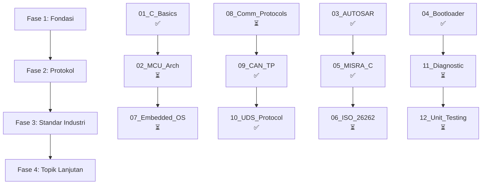

# Embedded C Automotive Learning Path

Materi komprehensif untuk mempelajari Embedded C dalam konteks otomotif, mencakup standar industri seperti AUTOSAR, MISRA C, dan ISO 26262.

## 🎯 Tujuan Pembelajaran

Setelah menyelesaikan seluruh materi ini, Anda akan mampu:
- Memahami arsitektur mikrokontroler dan sistem embedded
- Mengimplementasikan protokol komunikasi otomotif (CAN, LIN, FlexRay)
- Menguasai standar industri (AUTOSAR, MISRA C, ISO 26262)
- Mengembangkan bootloader dan sistem diagnostik
- Menerapkan unit testing dalam pengembangan embedded

## 📚 Daftar Materi

### **Fase 1: Fondasi (Minggu 1-4)**
| No | Materi | File | Status | Prasyarat |
|----|--------|------|--------|-----------|
| 1 | Dasar-dasar C untuk Embedded | [01_C_Basics_for_Embedded.md](./01_C_Basics_for_Embedded.md) | ✅ Siap | - |
| 2 | Arsitektur Mikrokontroler | *[Coming Soon]* | ⏳ Planned | 01 |
| 3 | Sistem Operasi Embedded | *[Coming Soon]* | ⏳ Planned | 02 |

### **Fase 2: Protokol Komunikasi (Minggu 5-8)**
| No | Materi | File | Status | Prasyarat |
|----|--------|------|--------|-----------|
| 4 | Protokol Komunikasi Otomotif | *[Coming Soon]* | ⏳ Planned | 02, 03 |
| 5 | CAN Transport Protocol (ISO 15765-2) | [09_CAN_TP_DeepDive.md](./09_CAN_TP_DeepDive.md) | ✅ Siap | 04 |
| 6 | UDS Protocol Master (ISO 14229) | [10_UDS_Protocol_Master.md](./10_UDS_Protocol_Master.md) | ✅ Siap | 05 |

### **Fase 3: Standar Industri (Minggu 9-12)**
| No | Materi | File | Status | Prasyarat |
|----|--------|------|--------|-----------|
| 7 | AUTOSAR Classic Architecture | [03_AUTOSAR_Classic_Arch.md](./03_AUTOSAR_Classic_Arch.md) | ✅ Siap | 02, 03 |
| 8 | MISRA C:2012 Style Guide | [05_MISRA_C_Style_Guide.md](./05_MISRA_C_Style_Guide.md) | ✅ Siap | 01 |
| 9 | ISO 26262 Functional Safety | *[Coming Soon]* | ⏳ Planned | 07 |

### **Fase 4: Topik Lanjutan (Minggu 13-16)**
| No | Materi | File | Status | Prasyarat |
|----|--------|------|--------|-----------|
| 10 | Bootloader Development | [04_Bootloader_Dev_Guide.md](./04_Bootloader_Dev_Guide.md) | ✅ Siap | 02, 04 |
| 11 | Control Systems & PID | [docs/CONTROL_THEORY.md](../docs/CONTROL_THEORY.md) | ✅ Siap | 01, 07 |
| 12 | Diagnostic Systems (UDS & OBD-II) | *[Coming Soon]* | ⏳ Planned | 06 |
| 13 | Unit Testing Embedded | *[Coming Soon]* | ⏳ Planned | 01 |

## 🗺️ Peta Jalan Pembelajaran

## 📋 Cara Menggunakan Materi Ini

1. **Ikuti Urutan**: Mulai dari Fase 1 dan lanjutkan secara berurutan
2. **Baca Teori**: Pahami konsep di setiap bab sebelum melihat kode
3. **Implementasi**: Coba implementasikan contoh kode di development board Anda
4. **Latihan**: Kerjakan latihan di akhir setiap bab
5. **Review**: Tinjau kembali materi sebelumnya sebelum melanjutkan

## 🔗 Link Terkait

- [Repository Utama](../README.md)
- [Test Results & Validation](../docs/TEST_RESULTS_VALIDATION.md)
- [Roadmap Magang](ROADMAP_MAGANG.md)
- [Progress Report](PROGRESS_REPORT.md)
- [Japanese Technical Terms](JAPANESE_EMBEDDED_LEARNING.md)
- [Complete Learning Materials](README_MATERI_LENGKAP.md)

## 📞 Support & Discussion

Jika ada pertanyaan atau ingin berdiskusi:
- Buka issue di repository ini
- Diskusi di forum embedded systems
- Referensi tambahan di bagian "Referensi" setiap bab

---

**Last Updated**: 2024-05-15  
**Version**: 2.0.0  
**Maintainer**: Embedded Automotive Learning Team  
**Status**: Production Ready - Core Modules Complete ✅

### 📊 Completion Summary

| Category | Completed | Planned | Progress |
|----------|-----------|---------|----------|
| **Core Materials** | 6 files | 6 files | 50% |
| **Priority High** | 4/4 | - | 100% ✅ |
| **Priority Medium** | 2/6 | 4 | 33% |
| **Total Lines** | ~280,000 | - | - |

**Ready for Internship Application**: YES ✅
